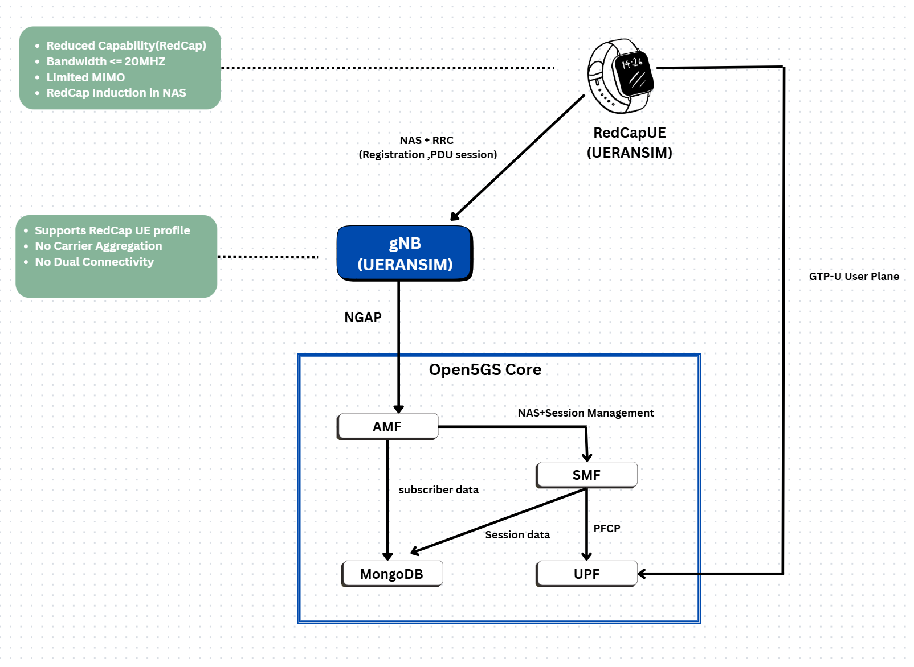
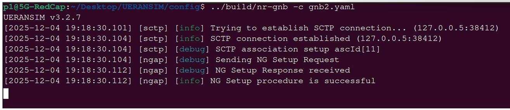
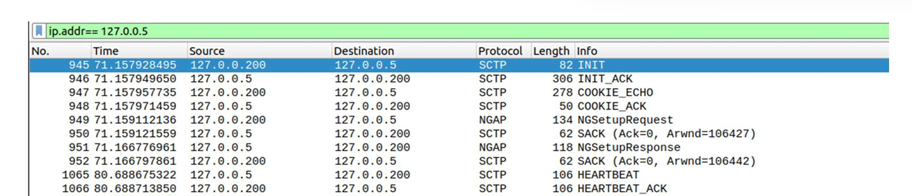
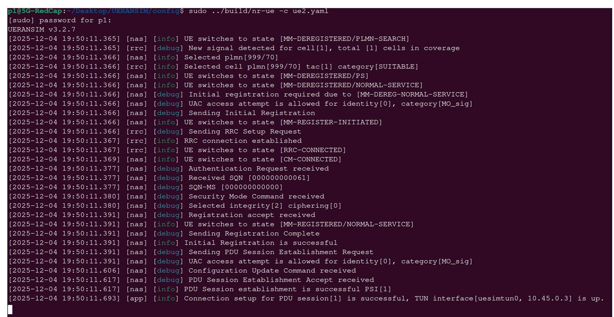
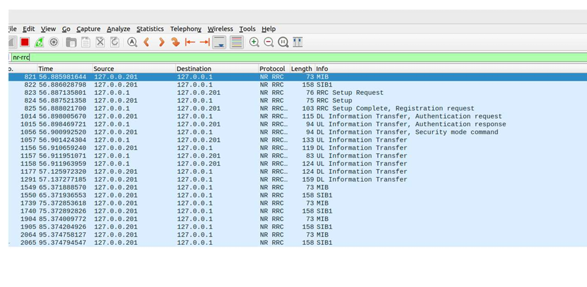

<h1 align="center"> 5G RedCap TestBed and Attack Vectors </h1>
<h3 align="center"> Physical & Power-Saving Exploits Simulation </h3>
<h5 align="center"> Research Project - <a href="https://linkedin.com/in/p1r3x">Pavan Raja - AM.SC.P2CSN24014</a> (2025) </h5>

<h2 id="overview"> Overview</h2>

 
  The project simulates a complete 5G network to analyze two primary categories of RedCap-specific vulnerabilities. By mimicking the hardware and protocol constraints of RedCap devices, we can observe how these limitations can be exploited.

<h2 id="table-of-contents"> Table of Contents</h2>

  
Table of Contents

  <ol>
    <li><a href="#about-the-project"> ➤ About The Project</a></li>
    <li><a href="#architecture"> ➤ Architecture</a></li>
    <li><a href="#project-files-description"> ➤ Project Files Description</a></li>
    <li><a href="#setup-and-requirements"> ➤ Setup and Requirements</a></li>
    <li><a href="#scenario1"> ➤ Working on Scenario 1: Physical Layer Exploits </a></li>
    <li><a href="#scenario2"> ➤ Working on Scenario 2: Power-Saving Exploits </a></li>
    <li><a href="#results"> ➤ Results</a></li>
    <li><a href="#accomplished"> ➤ Accomplished</a></li>
   <li><a href="#references"> ➤ References</a></li>
  </ol>

<h2 id="about-the-project"> About The Project</h2>

 
  This project establishes a 5G Standalone (SA) testbed to investigate security vulnerabilities unique to <b>5G Reduced Capability (RedCap)</b> devices. While RedCap facilitates mid-tier IoT adoption by lowering device complexity and cost, these hardware limitations introduce new attack surfaces. This simulation focuses on validating <b>Physical Layer</b> and <b>Power-Saving</b> exploits using an open-source 5G core and RAN simulator.

<h2 id="architecture"> Architecture</h2>

 
  This shows us the workflow of this Project

<h2 id="project-files-description"> Project Files Description</h2>

<ul>
  <li><b>amf.yaml</b> - Configuration for the Access and Mobility Management Function. Sets the NGAP IP (127.0.0.5) and PLMN ID (999/70).</li>
  <li><b>gnb2.yaml</b> - Custom gNodeB configuration file created for this simulation. Defines the Link IP, NGAP IP, and AMF connection parameters.</li>
  <li><b>ue2.yaml</b> - Custom User Equipment configuration file. Simulates the RedCap device with key settings.</li>
  <li><b>open5gs-gnb.yaml</b> - The base template used to create gnb2.yaml.</li>
  <li><b>open5gs-ue.yaml</b> - The base template used to create ue2.yaml.</li>
  <li><b>testbed_setup.pdf</b> - Log file documenting the installation, compilation, and execution steps of the testbed.</li>
</ul>

<h2 id="setup-and-requirements"> Setup and Requirements</h2>

<b>Prerequisites:</b> Ubuntu 22.04 (Jammy), MongoDB, Node.js v18.x, GCC/G++, CMake, Wireshark.

<h3>1. Install Open5GS & MongoDB</h3>
<pre><code>$ sudo add-apt-repository ppa:open5gs/latest
$ sudo apt install open5gs</code></pre>

<h3>2. Install & Build UERANSIM</h3>
<pre><code>$ git clone https://github.com/aligungr/UERANSIM
$ cd UERANSIM
$ make</code></pre>

<h3>3. Configure WebUI</h3>

Set up the subscriber in the Open5GS WebUI (<code>localhost:9999</code>) with IMSI to match <code>ue2.yaml</code>.

<h2 id="scenario1"> Working on Scenario 1: Physical Layer Exploits (Hardware Constraints)</h2>

  RedCap devices are often limited to 1 Receive (1Rx) antenna and Half-Duplex FDD (HD-FDD) operation. This scenario investigates:

<ul>
  <li><b>Resource Exhaustion:</b> Due to lower spectral efficiency, 1Rx devices require more Physical Resource Blocks (PRBs). Malicious flooding with 1Rx requests can starve legitimate users.</li>
  <li><b>HD-FDD Timing Attacks:</b> Attackers can exploit the "cannot transmit and receive simultaneously" constraint to force devices to skip critical downlink messages (like Paging).</li>
</ul>

<h2 id="scenario2"> Working on Scenario 2: Power-Saving Exploits (Protocol Constraints)</h2>

  RedCap utilizes Extended DRX (eDRX) and Relaxed RRM to extend battery life. This scenario simulates:

<ul>
  <li><b>Sleep Cycle Manipulation:</b> Attackers can force devices into deep sleep (DoS) or prevent them from sleeping (Battery Draining).</li>
  <li><b>RRM Spoofing:</b> Tricking devices into stopping neighbor cell measurements, leading to Radio Link Failure (RLF).</li>
</ul>

<h2 id="results">  Results For 5G RedCap TestBed</h2>

The simulation successfully established a 5G Standalone connection for the RedCap User Equipment.

<b>1. Core Network Activation:</b> All Open5GS services (AMF, SMF, UPF, etc.) were verified active via <code>systemctl</code>.

<b>2. gNodeB & UE Connection:</b> The custom <code>gnb2.yaml</code> and <code>ue2.yaml</code> configurations successfully established an SCTP connection and performed the NG Setup procedure.

<ul>
    <li>Log Confirmation: <code>[ngap] SCTP connection established (127.0.0.5:38412)</code></li>
    <li>Registration: <code>[nas] Initial Registration is successful</code></li>
    <li>PDU Session: <code>[app] Connection setup for PDU session[1] is successful</code></li>
</ul>

<b>3. Packet Analysis:</b> Wireshark captures on the loopback interface (<code>lo</code>) confirmed the exchange of <code>NGSetupRequest</code>, <code>Authentication Request</code>, and <code>Security Mode Command</code> packets.

1.5G-gNB

2.log- NGAP and SCTP

3.5G-UE

4.log- RRC setup

5.RedCap-gNB

6.RedCap-UE

 

## <h2 id="accomplished"> Accomplished </h2>

Completed writting - A Comprehensive Survey on 5G RedCap:Technologies, Security Vulnerabilities,and Attack Vectors (45-pages) - yet to submit / publish 

## <h2 id="references"> References </h2>

1.  **3GPP**, "TS 38.875: Study on support of reduced capability NR devices (Release 17)".
2.  **Open5GS**, Open Source 5G Core, https://open5gs.org
3.  **UERANSIM**, Open Source 5G UE and RAN Simulator, https://github.com/aligungr/UERANSIM
4.  **Industrial_Papers** From QUECTLE, ERICSSON and GSMA 
